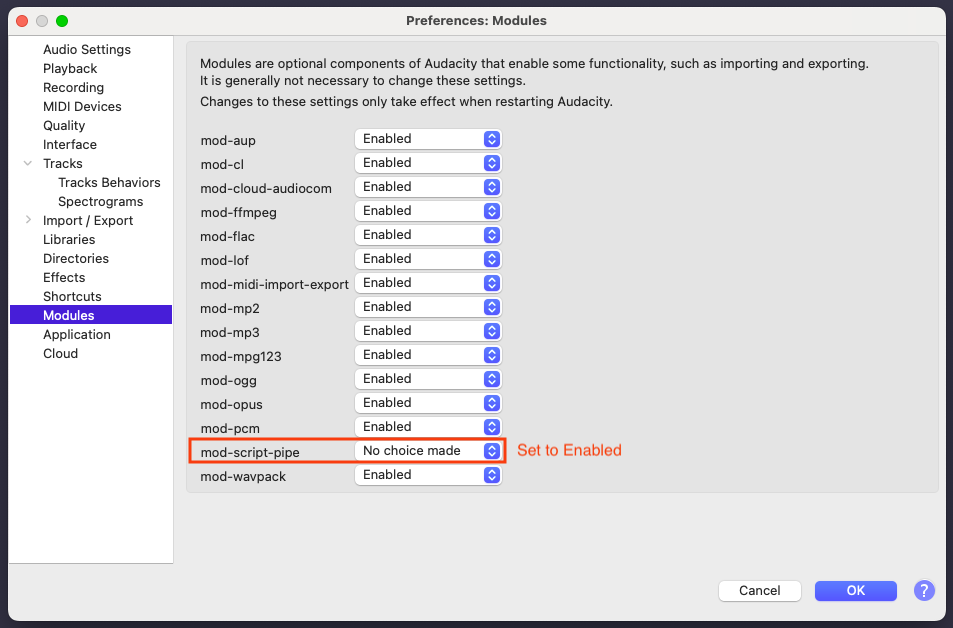

# Catshand (Cat's Hand)

Current Audacity support: 3.6.1

Catshand (Cat's Hand) is a toolbox designed for audio editing and production in the team of Tripod Cat's Podcast. Catshand is named after the Japanese idiom "猫の手も借りたい", which means "so busy someone wants to borrow even the paw of a cat." It simplifies the audio editing process by automating repetitive tasks and integrating with the popular editing tool Audacity. Catshand provides OpenAI-powered transcription and content summary, so users can focus on the creative process, rather than spending time on content searching.  


## Installation

1. pull this git repository
2. move to the directory of catshand
3. create conda environment

    ```shell
    conda create -n catshand -y -c conda-forge python=3.9 ffmpeg mamba 
    ## catshand can be replaced by your-own-env-name
    ```

4. Change conda env

    ```shell
    conda activate catshand
    ```

5. Installation

    - For general users

        ```bash
        # for Mac users
        pip install catshand
        
        # highly recommend to run pip install using uv (a lot faster than pip only)
        # 1. install uv via homebrew
        # (if brew is not installed, please install homebrew first. Please see https://brew.sh/ for more details)
        brew install uv
        # 2. install catshand using uv
        uv pip install catshand
        
        # for Windows users
        # please note that the catshand[win] is not fully tested
        pip install "catshand[win]"
        ```

    - For developers

        ```bash
        # Developers can install the package in editable mode
        # 1. clone the repository
        # 2. move to the directory of catshand or the root directory of the repository
        # 3. install the package in editable mode with development dependencies
        # install with pip
        pip install -e ".[dev]"
        # or install with uv+pip
        uv pip install -e ".[dev]"
        ```

6. **[Optional, Temporary Disabled]** Add OpenAI API key to the environment variable to use the transcript generation function and transcript summary. Please visit [OpenAI](https://openai.com/) to get the API key and [Best Practices for API Key Safety](https://help.openai.com/en/articles/5112595-best-practices-for-api-key-safety) for more details.

    ```shell

    # Windows (in cmd prompt)
    setx OPENAI_API_KEY “<yourkey>”
    
    # Mac
    echo "export OPENAI_API_KEY='<yourkey>'" >> ~/.zshrc
    ```

8. Download, install, and launch Audacity. Change the setting of **Modules** to **"Enabled"**. Support up to Audacity 3.7.1.
    

## Audio Editing

Catshand divides editing steps into two parts: pre-edit and post-edit. Pre-edit is the preparation process of raw audio files so they are ready for manual editing to remove filler words or undesirable phrases. Post-edit is the process of editing the finalized audio files and applying compressors and music, to make them ready for publishing.

All functions of catshand are implemented in the command line. The following sections will provide an example to jumpstart the usage of catshand. Please visit the [manuals](./src/catshand/doc/manuals.md) for more details.

### Download and Prepare Demo Files and Materials

1. Download demo files from this [link](https://drive.google.com/drive/folders/18VaKpXfOgM0KQbxOm8sdr8dGdOJpBT3t?usp=share_link)

2. Create a demo project folder in the root of project directory called "EP099", then move the downloaded folders "00_Raw" and "05_Highlight" to the project folder.

3. Download audio materials from Google Drive: [link](https://drive.google.com/drive/folders/1vwkKg64AObKdqqiLxe1SyYdqx3ysGs3P?usp=share_link). This step is optional if you are using catshand only for pre-editing. Move the folder to the root directory of catshand.

4. Run the following shell script:

    ```bash
    export PROJECT_DIR=/path/to/prject/EP099
    export MATERIAL_DIR=/path/to/material
    ```

### Scenario 1: Preprocessing for Editing Helpers

1. Create a project folder in the root directory of catshand using the following command:

    ```bash
    # CLI syntax
    # catshand prjinit -d <root_dir> -n <project_name> -m <material_dir>
    catshand prjinit -d $PROJECT_DIR -n EP099 -m $MATERIAL_DIR
    ```

    Answer the questions in the terminal. The project folder will be created in the root directory of catshand.

1. Run the following commands in order:

    ```shell
    # convert m4a to wav with filename matching
    catshand audio2wav -p $PROJECT_DIR -m

    # perform loudness normalization and noise reduction
    catshand audio2wav -p $PROJECT_DIR -i $PROJECT_DIR/00_Raw_wav -lr -t 4
    
    # remove silence
    catshand silrm -p $PROJECT_DIR -i $PROJECT_DIR/00_Raw_wav_wav -pz -t 4
    
    # split audio files
    catshand audiosplit -p $PROJECT_DIR -i $PROJECT_DIR/00_Raw_wav_wav_silrm -ts 00:02:00 00:04:00 # split audio files
    ```
##########3

5. To split the file after track merging, you can run the following commands:

    ```shell
    # merge audio files into one track 
    # convert to stereo and spatial audio features
    # mergered audio exported to "merged" folder
    catshand trackmerger -p /path/to/project/Podcast/EP099/ -s -sp
    
    # split audio files
    catshand audiosplit -p /path/to/project/Podcast/EP099/ -i /path/to/project/Podcast/EP099/merged -ts 00:02:00 00:04:00 
    ```

## with editing service

### Pre editing

1. Initiate the project folder

    ```shell
    catshand prjinit -d /path/to/project/Podcast/ -n EP099 -m /path/to/project/Podcast/material
    ```

2. Convert the audio file to wav (even the original file is wav)

    ```shell
    catshand audio2wav -p /path/to/project/Podcast/EP099/ -i /path/to/project/Podcast/EP099/02_To_merge -lr -t 4
    ```

3. Merge each session (multiple tracks) into one track

    ```shell
    catshand trackmerger -p /path/to/project/Podcast/EP099/  -i /path/to/project/Podcast/EP099/02_To_merge_wav_manual -s -v 0 0 4
    ```

### Post editing

1. Convert the audio file to wav (even the original file is wav)

    ```shell
    catshand audio2wav -p /path/to/project/Podcast/EP099/ -i /path/to/project/Podcast/EP099/03_Editing_02 -l -t 4 
    ```

2. Create audio metadata using the audio merger

    ```shell
    catshand audmerger -p /path/to/project/Podcast/EP099 -i /path/to/project/Podcast/EP099/03_Editing_02_wav -t 4 -s
    ```

3. Load into Audacity

    ```shell
    catshand audacitypipe -p /path/to/project/Podcast/EP099 -i /path/to/project/Podcast/EP099/03_Editing_02_wav_merged -s -c importrecording importmaterial addmusic
    ```

4. Create transcriptions

    ```shell
    catshand prjsummary -p /path/to/project/Podcast/EP099/ -i /path/to/project/Podcast/EP099/09_export_tran -o /path/to/project/Podcast/EP099/09_export_tran -t 4
    ```

5. Get highlight

    ```shell
    catshand audio2wav -p /path/to/project/Podcast/EP099/ -i /path/to/project/Podcast/EP099/05_Highlight -l
    ```

6. Load all into Audacity

    ```shell
    catshand audacitypipe -p /path/to/project/Podcast/EP099 -i /path/to/project/Podcast/EP099/03_Editing_02_wav_merged -s
    ```
